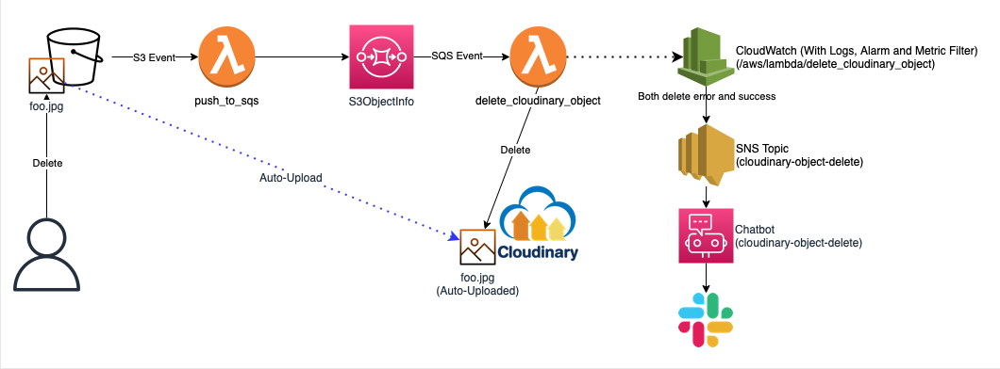
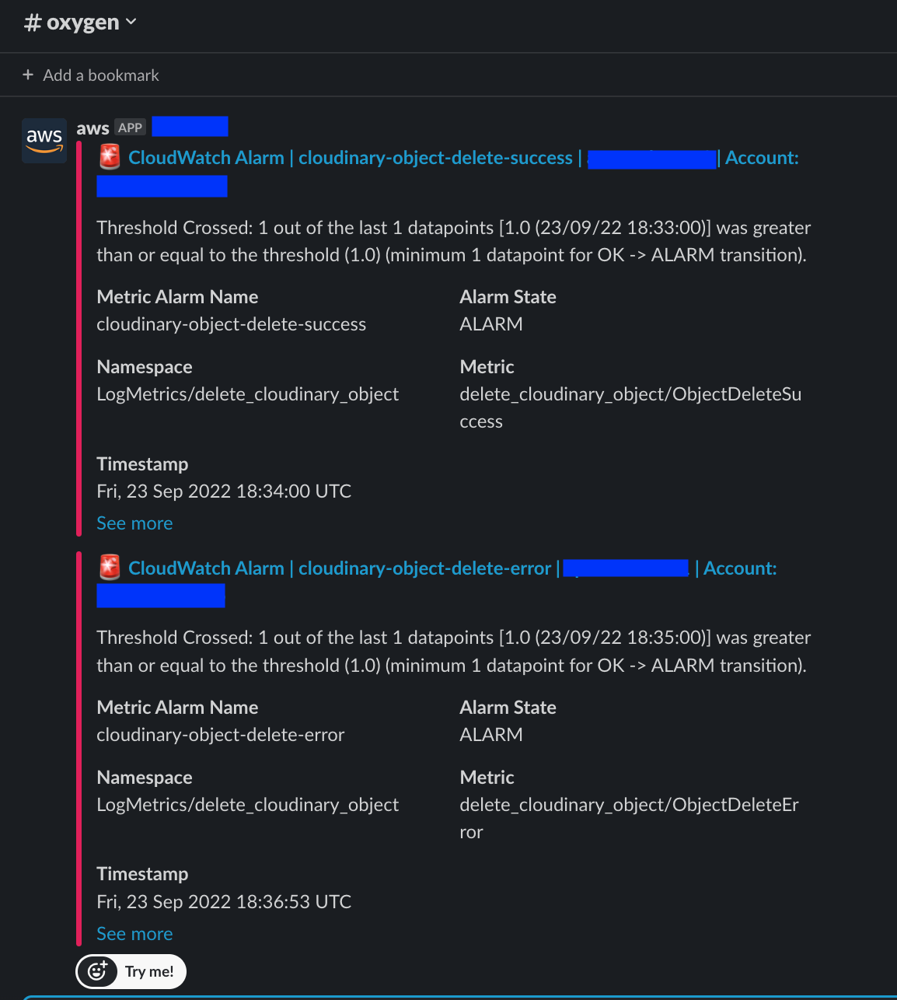

**Actions:**
[](https://github.com/e1ifas/cloudinary-remote-files-sync-s3/actions/workflows/sam-validation.yaml)
[](https://github.com/e1ifas/cloudinary-remote-files-sync-s3/actions/workflows/yamlfmt.yaml)
[](https://github.com/e1ifas/cloudinary-remote-files-sync-s3/actions/workflows/yapf.yaml)
[](https://github.com/e1ifas/cloudinary-remote-files-sync-s3/actions/workflows/pytest.yaml)

**Code Style:**
[](https://github.com/google/yamlfmt)
[](https://github.com/google/yapf)

# cloudinary-remote-files-sync-s3

[Cloudinary](https://cloudinary.com)'s [Auto-upload remote files](https://cloudinary.com/documentation/fetch_remote_images#auto_upload_remote_files) enables automatic upload from S3 to Cloudinary, but *automatic deletion* (i.e.: when you delete a content on S3, auto-uploaded content on Cloudinary is also deleted) is not supported.

This SAM project is a set of AWS resources to enable it by utilizing [Python SDK](https://cloudinary.com/documentation/django_integration).

Some related components are included such as AWS Chatbot (to notify application error to Slack) ...etc.



# How to use

## Create CFn stack of Github Oidc IAM Role for GitHub Actions

- This role is required to run GitHub Actions `sam-validation.yaml`.
- Set value to `OIDCProviderArn` if you already have configured GithubOidc, otherwise CFn tries to create it and fail!

```bash
# Just an example. Edit for your own environment.
aws cloudformation create-stack \
  --stack-name github-oidc-iam-role-cloudinary-remote-files-sync-s3 \
  --template-body file://path/to/GitHubOIDC.yaml \
  --parameters ParameterKey=GitHubOrg,ParameterValue=e1ifas ParameterKey=RepositoryName,ParameterValue=cloudinary-remote-files-sync-s3 \
  --capabilities CAPABILITY_IAM CAPABILITY_NAMED_IAM
```

Then, you can get outputs by below:

```bash
# Just an example. Edit for your own environment.
aws cloudformation describe-stacks \
  --stack-name github-oidc-iam-role-cloudinary-remote-files-sync-s3 \
  | jq -r '.Stacks[] | .Outputs[]'
```

Note that `RoleArn` is required at the next section.

## Register parameters to GitHub secrets

You need to register parameters below to GitHub secrets. 

- `AWS_REGION`
  - Set to your own region.
- `AWS_ROLE_TO_ASSUME`
  - Set a value output as `RoleArn` avobe.

Now, GitHub Actions [`sam-validation.yaml`](.github/workflows/sam-validation.yaml) will run properly.

## sam deploy

Run below to deploy the project.

```bash
sam validate
sam build --use-container
sam deploy --guided
```

# Appendix

## Code style (See badge)

### yapf

```bash
yapf --in-place --style='{based_on_style: facebook, indent_width: 2, CONTINUATION_INDENT_WIDTH: 2}'
```

### yamlfmt

```bash
yamlfmt
```

## Slack notification

will be as below.

